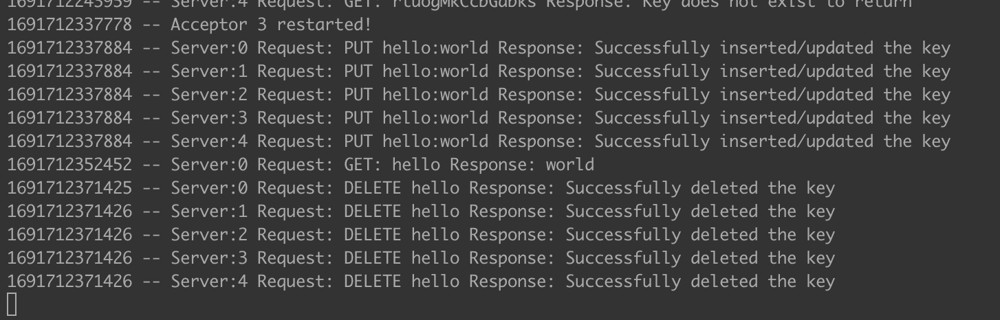

# Build

Execute the following command in root directory of the project:

```
javac -cp ".:lib/*" server/*.java
```

# Run
Run the below commands to execute the project.

Start the server using the following command in a new terminal:
```
java -cp ".:lib/*" server.PaxosServerCreator
```

Finally, start the client with the following command in a new terminal:

```
java -cp ".:lib/*" server.KeyValueClient
```


PFA screenshots of outputs of both the implementations.


## Pre-defined data:

**Server:**


Note: Complete server log could not be captured since, each of the replica is
logging while committing.

**Client:**


## Manual Input:

**Server:**


**Client:**


# Executive Summary

## Project Execution


A client-server application that communicates over RMI. It has multiple servers and multiple clients can request data from any of the servers. Each of the server has their individualized data store. All the data stores are synchronized by using the Paxos algorithm. There are learners, proposers and acceptors implemented to ensure the working of Paxos. Togeather, it creates a distributed fault-tolerant key-value store.

Each server stores a key-value store and provides access to create, edit, read, and delete operations on the store using GET, PUT, and DELETE requests.

- The GET request gets the value associated with the given key.
- The PUT request puts a new key-value pair in the store if the key does not already exist. If the key does exist, the value is updated.
- The DELETE request deletes the key-value pair from the store if the key exists. If the key does not exist, an error is thrown.

Explicit requests are not made like TCP/UDP. But there are methods defined for each of the above requests in the server. These methods are exposed to the client so that the client calls these methods using RMI.

For PUT/DELETE, the client sends a request to the proposer. The proposer then proposes the value to the acceptor. The acceptor only accepts the request which has the highest sequence number of all the prposers. If majority of acceptors accept the proposal, the proposer initiates a accept request. If any of the acceptor rejects the operation. The proposer sends accept with the operation that the rejected acceptor sent.

If the acceptor accepts the request, it notifies all the learners with the change. If not, it just ignores it. All the learners wait till they get the majority. Once, they received the majority, it performs the operation on the key-value store.

All the request / response data needs to be logged by both client and server timestamp and a pre-defined logging format.

**Note:** PUT checks for key in datastore. If it exists, it updates with new value. If key does not exist, it creates it.

## Technical Impression

Project 4 was a valuable learning experience that gave me a good understanding of how to implement and communicate through RMI and implement Paoxs protocol.
This is my first time working with Paxos protocol and I had a great time learning it. This knowledge will be helpful for future projects that require me to build distributed client-server applications.

The server is thread-safe. These implement thread-safe mechanisms for both delete and put methods. There is not need for GET to be thread-safe since it does not perform any write operations. 

For the GET request, the client sends the reqest to any of the server. The server then reads from it's key-value store and return the value. 
For the PUT/DELETE requests, Paxos algorithm is executed. The operation is only propagated if majority of the acceptors are okay with it. If not, the operation is discarded.

In conjunction with the server, an additional thread is activated to intermittently brings down the acceptors in a random manner. When an acceptor is down, it remains in a down state for a predetermined duration of 60 seconds. After this interval, it is automatically reactivated. This process ensures that only a single acceptor is down at any given time. Nevertheless, multiple acceptors may experience deactivation over the course of time.

In case of PUT / DELETE requests, the client sends a request to one of the proposers. The proposer initiates the submission of a value to the acceptor. However, the acceptor exclusively accepts the request that holds the highest sequence number among all proposers. Once the proposal is accepted by the majority of acceptors, the proposer triggers an acceptance request. In case any acceptor declines the operation, the proposer communicates an acceptance with the operation initially submitted by the rejected acceptor. Upon accepting the request, the acceptor notifies all learners about the change. Conversely, if the request is rejected, the acceptor disregards it. Subsequently, all learners remain in a waiting state until they achieve a consensus among the majority. Once consensus is attained, the operation is executed on the key-value store.

Every acceptor keeps a record of all incoming requests in a log. The acceptor verifies the sequence number against this log, ensuring that the sequence numbers only advance incrementally. These sequence numbers are generated by combining the serverId and the Unix timestamp. The Paxos is only implemented on PUT/Delete operations since GET does not need it. The thread-saftey mechanisms are implemented using conccurent hashmap and synchronized keyword.

Both the client and server are rigorously tested to ensure that they work properly under all conditions. Any exceptions that occur during testing are handled gracefully. For example, if the server takes too long to respond, the client will wait for a few seconds before sending a new request. If the server still does not respond, the client will ignore the request and continue with the next task.

The client is provided with two ways to execute requests: directly or through the CLI. The direct method allows users to execute a few predefined requests, while the CLI allows users to execute any GET, PUT, or DELETE request by manually inputting the data. The user could also select which replca server to send the request to or choose an option to select random server.
Overall, this project was a great opportunity to explore various aspects of distributed systems and low-level programming. I learned how to synchronize data across multiple machines, how to handle errors, and how to build a fault tolerant reliable distributed consensus system.
